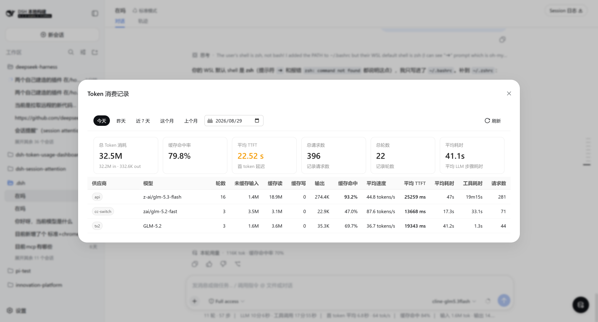

# dsh-token-usage-dashboard

English | [中文](README.md)

Cross-session token usage dashboard plugin for [DeepSeek Harness](https://github.com/deepseek-ai/deepseek-harness).

This plugin captures per-request token usage from the model firehose, persists it to a SQLite database, and renders a floating dashboard panel in the web GUI showing daily `(provider, model)`-grouped totals: token buckets, throughput, TTFT, LLM step time, and cache-hit ratio.



## Architecture

Three packages compose the full feature:

| Package | Name | Role |
|---|---|---|
| `host/` | `@deepseek-ai/dsh-token-usage` | Session/event listener that captures per-request usage records and exposes a `TokenUsageStore` Service Definition backed by SQLite |
| `client/` | `@deepseek-ai/dsh-client-token-usage` | Browser dashboard panel registering into `shell.overlay` — a floating button opening a modal with daily totals |
| `bundle/` | `@deepseek-ai/dsh-token-usage-dashboard` | Profile bundle: one `cordis.patch.yml` inserting all four rows (SQLite provider + capture listener + Remote service + browser panel) |

### Data flow

```
Model call → session/event listener → TokenUsageStore.append(record)
                                        ↓
                                   SQLite database
                                        ↓
                            TokenUsageRemoteService.dailySummary(date, timeZone)
                                        ↓  (Typert Remote RPC)
                            Browser panel (shell.overlay entry)
```

The capture listener folds step boundaries through the shared `@deepseek-ai/dsh-step-timing` primitives (`step/start` → first token → `assistant/message`), so TTFT and decode durations agree with the session-scoped projection. The browser panel sends the local timezone (`browserTimeZone`) with each request, so the host bounds the day by the same zone.

## Installation

```sh
dsh plugin --profile <name> add https://github.com/my-dsh/dsh-token-usage-dashboard/releases/download/dist/dsh-token-usage-dashboard-dist.tgz
```

The package declares `dsh.bundle`, so installing it joins the profile's bundle layer stack automatically; restart DSH to take effect.

The panel renders only inside a web surface, so the target profile must already provide the client runtime, connection, and `shell.overlay` layout. Requires `pnpm` on `PATH`.

### SQLite path

The default database location is `token-usage.sqlite` under the DSH home directory. Override via config:

```yaml
- id: token-usage-sqlite
  name: '@deepseek-ai/dsh-token-usage/sqlite-provider'
  config:
    path: /custom/path/to/token-usage.sqlite
```

## Usage

Capture starts on the next boot and needs no configuration: every successful model call appends one record. Open the dashboard from the floating button at the bottom-right of the shell, pick a date, and refresh.

The store never auto-deletes; `tokenUsage.purge(before?)` drops rows before an epoch-millisecond cutoff for retention.

## Source layout

```
dsh-token-usage-dashboard/
├── host/
│   ├── src/
│   │   ├── index.ts           # Session/event capture listener
│   │   ├── store.ts           # TokenUsageStore Service Definition + SqliteTokenUsageStore
│   │   ├── sqlite-provider.ts # Cordis plugin mounting the SQLite store
│   │   ├── remote.ts          # Typert Remote service (dailySummary, purge)
│   │   ├── types.ts           # UsageRecord, DailySummary types
│   │   ├── types.d.ts         # Generated type declarations
│   │   ├── invariant.ts       # Package invariant companion
│   │   └── ...
│   └── package.json
├── client/
│   ├── src/
│   │   ├── index.ts           # Host loader entry (empty apply)
│   │   ├── invariant.ts       # Package invariant companion
│   │   ├── client/
│   │   │   ├── index.ts       # Browser plugin: shell.overlay registration
│   │   │   ├── slots.ts        # Inject face + Remote API call
│   │   │   ├── TokenUsageDashboard.tsx  # Dashboard panel component
│   │   │   ├── format.ts       # Number/date formatting
│   │   │   ├── locales.ts      # Chinese locale dictionary
│   │   │   └── ...
│   │   └── ...
│   └── package.json
├── bundle/
│   ├── cordis.patch.yml       # 4-row insert: provider + listener + remote + panel
│   ├── src/
│   │   ├── index.ts           # Empty carrier
│   │   └── invariant.ts       # Bundle invariant companion
│   └── package.json
└── package.json               # Root workspace
```

## Dependencies

This plugin depends on the following DSH packages (installed from the DSH monorepo):

- `@deepseek-ai/cordis` — Cordis plugin framework
- `@deepseek-ai/dsh-session` — Session events and types
- `@deepseek-ai/dsh-llm` — LLM message utilities
- `@deepseek-ai/dsh-step-timing` — Step boundary timing primitives
- `@deepseek-ai/dsh-zoned-time` — Timezone day bucketing
- `@deepseek-ai/dsh-typert-protocol` — Typert Remote protocol
- `@deepseek-ai/dsh-api-remotes` — Remote client assembly
- `@deepseek-ai/dsh-client-ui-layout` — `shell.overlay` slot owner
- `@deepseek-ai/dsh-client-ui-renderer` — Slot registry service
- `@deepseek-ai/dsh-client-locale` — Locale service

## License

MIT
